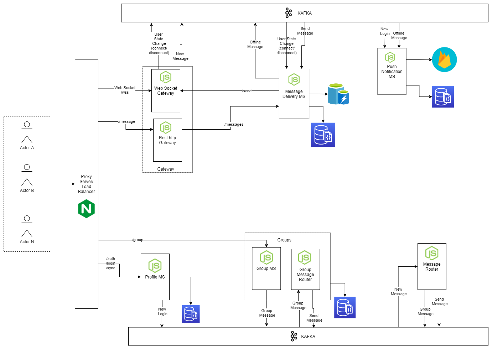

# Chat Server
[](https://gitpod.io/#https://github.com/ramank775/chat-server) 

A chat server based on the microservice architecture to ensure high availability, high throughput, horizontal scalability using Kafka

## Architecture


### Components
- Nginx: Nginx act as API gateway as well as load balancer.
    - Responsibility
        - API Gateway
        - Authentication
        - Load Balancing
  
- Web Socket Gateway: It's handling client websocket connection and sending message to message broker
    - Responsibility
        - Maintaining Web Socket Connection
        - Forwarding event like `onConnect`, `onDisconnect`, `new-message` to message broker (Kafka)
        - Sending message back to client
  
- Profile MS: Rest Api Service provides functionality like `login`, `auth`, `contact-sync` 
    - Responsibility
        - Login, Auth
        - Contact Sync

- Group MS: Rest Api Service provides functionality to `create`, `update`
    - Responsibility
        - Create Group
        - Add, Remove Members
        - Fetch groups

- Session MS: Maintaining the info about which user connected to which gateway instance.
    - Responsibility
        - Maintain User connection state

- Message Router: Route the incoming `new message` to respective destination
    - Responsibility
        - Route 1-to-1 chat message to gateway
        - Route message to store/push notification
        - Retry failed message
        - Route group message to Group Message Router

- Group Message Router: Route the incoming group messages to respective destination
    - Responsibility
        - Route Group Message to respective destination

- Push Notification: Deliver message to user when user is offline
    - Responsibility
        - Deliver message to offline user

- Persistence Storage service: To store message until it got delivered
    - Responsibility
        - Store message new user is offline
        - Deliver message as user come online

## Directory Structure

| Name |  Description |
| ---- |  ----------- |
| deployment | Deployment scripts, configurations for dev as well as prod |
| docs | Docs related to the project |
| helper | Common utility functions |
| libs | Project specific libs like base class for microservice, resource configuration and initialization |
| services | Microservice |
| www | Web based testing interface |
| .env.tmpl | Environment template file |
| .gitpod.Dockerfile | Docker file for gitpod setup |
| .gitpod.yml | Gitpod configuration file |
| LICENSE | Project License file (MIT) |
| package.json | Node project configuration file |
| README.md | Project description and other details |

## How to setup

### Use Gitpod as development environment
Click on the Gitpod badge it will start the fully setup development environment.

 [](https://gitpod.io/#https://github.com/ramank775/chat-server) 

### Development environment on local machine

### Prerequisites
- Apache Kafka
- Mongodb
- Nginx
- Firebase project 

### Steps
- Clone the master branch of the project
- Install dependencies

    ``` 
    npm install 
    ```
    Or 
    ``` 
    yarn install 
    ```
- Make copy of `.env.tmpl` to `.env` and update the required variables
    ```
    cp .env.tmpl .env
    ```
- Initialize Kafka 
    ```
    cd deployment/dev/scripts
    ./init-kafka.bash ${KAFKA_INSTALLATION_DIRECTORY} .env
    ```
- Open project in vscode
- Start the required microservice from `RUN and DEBUG` option
- (Optional) Start nginx using the configuration [deployment/dev/config/nginx.config](./deployment/dev/config/nginx.config)


## LICENSE
 [MIT](./LICENSE)